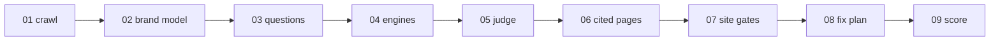

<p align="center">
  <picture>
    <source media="(prefers-color-scheme: dark)" srcset="https://raw.githubusercontent.com/yotambraun/saylent/main/website/public/brand/wordmark-dark.svg">
    
  </picture>
</p>

<p align="center">
  The open-source audit of what AI assistants say about your brand, with the receipts.
</p>

<p align="center">
  <a href="https://yotambraun.github.io/saylent/docs">Docs</a> ·
  <a href="https://yotambraun.github.io/saylent/docs/quickstart">Quickstart</a> ·
  <a href="https://yotambraun.github.io/saylent/samples/kestrel/report.html">Sample report</a> ·
  <a href="https://saylent-demo.vercel.app/app">Live demo</a>
</p>

<p align="center">
  <a href="https://github.com/yotambraun/saylent/actions/workflows/ci.yml"></a>
  <a href="https://www.npmjs.com/package/saylent"></a>
  <a href="https://www.npmjs.com/package/saylent"></a>
  <a href="https://www.npmjs.com/package/saylent"></a>
  <a href="LICENSE"></a>
</p>

```bash
npx saylent audit example.com
```

<table>
  <tr>
    <td width="50%" align="center" valign="top">
      <a href="https://yotambraun.github.io/saylent/samples/kestrel/report.html"><picture>
        <source media="(prefers-color-scheme: dark)" srcset="https://raw.githubusercontent.com/yotambraun/saylent/main/website/public/media/hero-report-dark.png">
        
      </picture></a><br>
      <sub><b><a href="https://yotambraun.github.io/saylent/samples/kestrel/report.html">Open the full sample report</a></b>: a real run against Kestrel Uptime, a fictional company we audit. <a href="examples/kestrel/">(source: examples/kestrel)</a></sub>
    </td>
    <td width="50%" align="center" valign="top">
      <a href="https://saylent-demo.vercel.app/app"><picture>
        <source media="(prefers-color-scheme: dark)" srcset="https://raw.githubusercontent.com/yotambraun/saylent/main/website/public/media/app-dark.gif">
        
      </picture></a><br>
      <sub><b><a href="https://saylent-demo.vercel.app/app">Open the live demo</a></b>: the same run inside the app, with history, a fix tracker and share links. Nothing saves, no account.</sub>
    </td>
  </tr>
</table>

Bring your own keys. One `OPENAI_API_KEY` or one `ANTHROPIC_API_KEY` runs the
audit with that engine. Two keys turn on the cross-family judge, where one
provider family judges the other's answers. A `GEMINI_API_KEY` and a
`PERPLEXITY_API_KEY` add those two engines. Export them, put them in a `.env` in
the folder you run from, or run `saylent keys set openai`.

With all four engines, a smoke run costs about **$0.60 to $1.20** of your own
provider credits and a full run about **$3.70 to $5.50**; our two recorded smoke
runs, both on four engines, cost $0.93 and $1.11. Fewer engines cost less. The
CLI defaults to the smoke profile; the self-hosted app defaults to the full
profile and shows the estimate before every run. `--dry-run` prints the plan and
the estimate for free, and `--max-usd 1` refuses to start above a cap. Nothing
is sent through us, and there is no telemetry. Node 20 or newer to run the CLI,
Node 22 or newer to develop or self-host the app, on macOS, Linux or Windows.

**Why this exists.**

- I cannot see what ChatGPT, Claude, Gemini and Perplexity tell my buyers about us.
- When a tool tells me I am invisible, I want the answer it read that from.
- I do not want a score. I want the next thing to change on my site.
- My API keys and my data should stay on my machine.
- I want the first result in about five minutes, without an account or a sales call.

Everything below is one story in six parts, the same six in the same order as
[the site](https://yotambraun.github.io/saylent/docs) and the docs sidebar, and
then one epilogue of small print.

## Run it once

One command, your own keys, and a report you can open from disk, email, or drop
in a ticket. It prints what it is about to spend before it spends anything, and
`--dry-run` costs $0. Every run writes three files: `report.html`
(self-contained, follows your system theme, safe to email), `report.md`, and
`run.json`, the lossless bundle with every raw answer, every sampled draw and
every citation, which is the input `saylent verify`, `saylent report` and
`saylent history` read later.

<p align="center">
  
</p>

And what comes out of it, with the receipt behind each claim:

<table>
  <tr>
    <td width="50%" align="center" valign="top">
      <picture>
        <source media="(prefers-color-scheme: dark)" srcset="https://raw.githubusercontent.com/yotambraun/saylent/main/website/public/media/receipt-verdict-dark.png">
        
      </picture><br>
      <sub><b>Verdict.</b> What the engines actually recommend, as a count over the questions that were scored, never a single invented number.</sub>
    </td>
    <td width="50%" align="center" valign="top">
      <picture>
        <source media="(prefers-color-scheme: dark)" srcset="https://raw.githubusercontent.com/yotambraun/saylent/main/website/public/media/receipt-answer-dark.png">
        
      </picture><br>
      <sub><b>Receipt.</b> The exact answer, the engine, the date, and the pages that answer was built from.</sub>
    </td>
  </tr>
  <tr>
    <td width="50%" align="center" valign="top">
      <picture>
        <source media="(prefers-color-scheme: dark)" srcset="https://raw.githubusercontent.com/yotambraun/saylent/main/website/public/media/receipt-gate-dark.png">
        
      </picture><br>
      <sub><b>Gate.</b> Which AI bots your site lets in: what robots.txt says per bot, and what actually happens when we fetch a page as one.</sub>
    </td>
    <td width="50%" align="center" valign="top">
      <picture>
        <source media="(prefers-color-scheme: dark)" srcset="https://raw.githubusercontent.com/yotambraun/saylent/main/website/public/media/receipt-fix-dark.png">
        
      </picture><br>
      <sub><b>Fix.</b> Drafted from your own evidence and ready to paste: here, the Organization, Product and FAQPage JSON-LD the crawl found missing.</sub>
    </td>
  </tr>
</table>

The flags a first run usually reaches for:

| Flag | What it does |
| --- | --- |
| `--max-usd <n>` | Refuse to run if the high cost estimate exceeds this many dollars. |
| `--dry-run` | Print the plan, the questions it would ask and the cost estimate. Spends nothing. |
| `--profile <name>` | `smoke` (6 questions, the default) or `full` (23 questions). |
| `--engines <a,b>` | Which engines to ask: `chatgpt`, `claude`, `gemini`, `perplexity`. Default: every one you have a key for. |
| `--samples <n>` | How many times each scored question is asked, 1 to 5. Default: 1 on smoke, 2 plus an adaptive tiebreak on full. |
| `--skip <a,b>` | Skip costly stages: `drafts` (no fix artifacts), `corpus` (no cited-page fetches), `gates` (no site checks). |
| `--questions <file>` | Ask your own set: a `run.json`, a `questions.json` from `saylent questions`, or a text file with one question per line. |
| `--judge <model>` | The judge model. Its provider family is inferred from the name. |
| `--model <role>=<id>` | Override one role's model. Roles: `brand`, `drafter`, `chatgpt`, `claude`, `gemini`, `perplexity`. |
| `--format <a,b>` | Which files to write: `md`, `html`, `json`. Default: all three. |

`saylent gate-check example.com` runs the site check on its own: what your
robots.txt says per AI bot, what a live fetch as each bot really gets back, your
JSON-LD and your meta directives, for $0 and no key at all. `saylent verify`
re-asks the same frozen questions after you ship a fix, and one cron line keeps
that going monthly with no database.

**Start here: [Quickstart](https://yotambraun.github.io/saylent/docs/quickstart)** ·
[every command and flag](https://yotambraun.github.io/saylent/docs/cli) ·
[questions and models](https://yotambraun.github.io/saylent/docs/questions-and-models) ·
[verify and history](https://yotambraun.github.io/saylent/docs/verify-and-history) ·
[check again next month](https://yotambraun.github.io/saylent/docs/scheduled-checks) ·
[the crawler](https://yotambraun.github.io/saylent/docs/crawler)

## Keep score as a team

Two people, five brands and a year of runs do not fit in a folder. The app is
the same engine with a memory: history across runs, a fix tracker that knows
what you shipped, rival comparison, scheduled verifies, and share links for
someone with no account. One deployment carries as many user accounts as you
like, each isolated from the others by row-level security, with one operator
who owns the keys and the bill. What it does not have is a shared workspace:
no per-seat roles, no seat billing, no switching between client accounts. Your
own Supabase project, on any Node host, Docker, or one click on Vercel. The
first sign-up becomes the operator, and there is no separate admin setup.

<table>
  <tr>
    <td width="50%" align="center" valign="top">
      <a href="https://saylent-demo.vercel.app/app"><picture>
        <source media="(prefers-color-scheme: dark)" srcset="https://raw.githubusercontent.com/yotambraun/saylent/main/website/public/media/app-dashboard-dark.png">
        
      </picture></a><br>
      <sub><b>Your brands, and the next move</b></sub>
    </td>
    <td width="50%" align="center" valign="top">
      <a href="https://saylent-demo.vercel.app/app/brand/20bfea58-b5d9-45ea-aea5-a2e6ae2774ef/questions"><picture>
        <source media="(prefers-color-scheme: dark)" srcset="https://raw.githubusercontent.com/yotambraun/saylent/main/website/public/media/app-questions-dark.png">
        
      </picture></a><br>
      <sub><b>Edit the questions, see the price</b></sub>
    </td>
  </tr>
  <tr>
    <td width="50%" align="center" valign="top">
      <a href="https://saylent-demo.vercel.app/app/run/e5e84797-71cd-4861-acf9-78ee5e42feb3?view=full"><picture>
        <source media="(prefers-color-scheme: dark)" srcset="https://raw.githubusercontent.com/yotambraun/saylent/main/website/public/media/app-report-full-dark.png">
        
      </picture></a><br>
      <sub><b>Every verdict, with the raw answer</b></sub>
    </td>
    <td width="50%" align="center" valign="top">
      <a href="https://saylent-demo.vercel.app/app/fixes"><picture>
        <source media="(prefers-color-scheme: dark)" srcset="https://raw.githubusercontent.com/yotambraun/saylent/main/website/public/media/app-fixes-dark.png">
        
      </picture></a><br>
      <sub><b>Fix tracker: open, shipped, watched</b></sub>
    </td>
  </tr>
</table>

Every app screenshot above is a screenshot of a running deployment, generated
by `npm run media` and regenerated on every release: never retouched, and every
one of them links to the same screen in the
[read-only demo](https://saylent-demo.vercel.app/app). The wordmark and the
pipeline diagram are the only drawn images in this file.

**Start here: [The app, screen by screen](https://yotambraun.github.io/saylent/docs/tour)** ·
[Deploy the app](https://yotambraun.github.io/saylent/docs/self-host) ·
[users and access](https://yotambraun.github.io/saylent/docs/self-host/users) ·
[share, export and track fixes](https://yotambraun.github.io/saylent/docs/sharing)

<p align="center">
  <a href="https://vercel.com/new/clone?repository-url=https%3A%2F%2Fgithub.com%2Fyotambraun%2Fsaylent&project-name=saylent&repository-name=saylent&env=NEXT_PUBLIC_APP_URL%2CNEXT_PUBLIC_SITE_URL%2CNEXT_PUBLIC_APP_NAME%2CNEXT_PUBLIC_SUPABASE_URL%2CNEXT_PUBLIC_SUPABASE_ANON_KEY%2CSUPABASE_SERVICE_ROLE_KEY%2CDATABASE_URL%2CDIRECT_DATABASE_URL%2COPENAI_API_KEY%2CANTHROPIC_API_KEY%2CINNGEST_EVENT_KEY%2CINNGEST_SIGNING_KEY&envDescription=Your%20own%20Supabase%20project%2C%20Inngest%20keys%20and%20LLM%20API%20keys%20-%20Saylent%20runs%20entirely%20on%20your%20accounts&envLink=https%3A%2F%2Fyotambraun.github.io%2Fsaylent%2Fdocs%2Fself-host%2Fenvironment"></a>
</p>

## Operate it for others

Somebody owns the keys, the bill and the blast radius. The operator console is
that person's back office: a daily spend cap that trips the kill switch when it
is crossed, a pause that refuses every new run at once, a model per role changed
with no redeploy, every run anyone started with its health and its real cost,
one page per account, a takedown queue, and an append-only audit log of who
changed what and why. Nothing there ever shows an API key, only whether one is
present and where it came from.

<table>
  <tr>
    <td width="50%" align="center" valign="top">
      <a href="https://yotambraun.github.io/saylent/docs/self-host/admin#providers-and-models"><picture>
        <source media="(prefers-color-scheme: dark)" srcset="https://raw.githubusercontent.com/yotambraun/saylent/main/website/public/media/app-admin-providers-dark.png">
        
      </picture></a><br>
      <sub><b>Keys and models per role</b></sub>
    </td>
    <td width="50%" align="center" valign="top">
      <a href="https://yotambraun.github.io/saylent/docs/self-host/admin#budget-and-limits"><picture>
        <source media="(prefers-color-scheme: dark)" srcset="https://raw.githubusercontent.com/yotambraun/saylent/main/website/public/media/app-admin-budget-dark.png">
        
      </picture></a><br>
      <sub><b>Spend cap and kill switch</b></sub>
    </td>
  </tr>
</table>

**Start here: [The operator console](https://yotambraun.github.io/saylent/docs/self-host/admin)** ·
[environment variables](https://yotambraun.github.io/saylent/docs/self-host/environment)

## Automate

One step on every push runs the same site check as the Gate receipt above:
robots.txt per bot, a live fetch as each crawler, JSON-LD and meta directives.
No LLM calls, no API keys, $0. It commits its status badge into your repo and
fails the job only when a search or user-fetch bot is blocked.

```yaml
# .github/workflows/ai-access.yml
on: [push]
jobs:
  ai-access:
    runs-on: ubuntu-latest
    steps:
      - uses: yotambraun/saylent@v0
        with:
          domain: example.com
```

`saylent mcp` serves the same pipeline over the Model Context Protocol, so
Claude Code, Claude Desktop or Cursor can audit a brand, verify a fix,
gate-check a site and read a report itself, under the same cost ceiling the
command enforces. And `import { runAudit } from "@saylent/engine"` plus
`import { renderReportHtml } from "@saylent/report/render/html"` run the same
pipeline and the same renderer from your own code, with your own persistence.

**Start here: [Run it automatically](https://yotambraun.github.io/saylent/docs/integrations)** ·
[the GitHub Action](https://yotambraun.github.io/saylent/docs/action) ([inputs and outputs](packages/action/)) ·
[the MCP server](https://yotambraun.github.io/saylent/docs/mcp) ·
[as a library](https://yotambraun.github.io/saylent/docs/library)

## Understand

<p align="center">
  <picture>
    <source media="(prefers-color-scheme: dark)" srcset="https://raw.githubusercontent.com/yotambraun/saylent/main/website/public/brand/pipeline-dark.svg">
    
  </picture>
</p>

<details>
<summary>The same nine stages as a Mermaid diagram</summary>



</details>

We ask real buyer questions to real AI engines through their official APIs and
record every answer verbatim. Presence is decided by a deterministic alias
match; a judge model from the other provider family decides the rest, quoting
its reasoning first. We fetch the pages an answer cites and check them for the
same presence, word match rather than entailment. We report a confidence band,
never a single fake-precise number.

**Start here: [How it works](https://yotambraun.github.io/saylent/docs/how-it-works)** ·
[methodology](https://yotambraun.github.io/saylent/docs/methodology) ·
[architecture](ARCHITECTURE.md) ·
[what it costs](https://yotambraun.github.io/saylent/docs/costs) ·
[what gets sent to providers](https://yotambraun.github.io/saylent/docs/data-sent)

## Project

The test suite needs no keys and no database: `npm install && npm test` runs the
full suite at $0. Running the app locally needs a Supabase project, which the
[self-host docs](https://yotambraun.github.io/saylent/docs/self-host) walk
through. Adding an answer engine is one file implementing the `Ask` interface;
adding a site check is one registry entry and one test. Issues are triaged
weekly by one maintainer; there is no support SLA.

**Start here: [Contributing](https://yotambraun.github.io/saylent/docs/contributing)** ·
[CONTRIBUTING.md](CONTRIBUTING.md) ·
[extending it](https://yotambraun.github.io/saylent/docs/extending) ·
[CODE_OF_CONDUCT.md](CODE_OF_CONDUCT.md) ·
[CHANGELOG.md](CHANGELOG.md)

## Before you rely on it

That is the six-part story. The epilogue is the small print, and it is short.

### What this does not tell you

- One run is a snapshot of the official API surface on one date. Consumer apps can answer differently, and Google AI Overviews has no API, so it is not measured.
- Share of voice counts mentions in the answers we drew, not market share, and cited-page checks are word presence, not entailment.
- No traffic estimate, no revenue effect, no ranking claim, and no claim that a fix caused a movement. Movement after a fix is correlation.

### Compared with hosted tools

What the hosted products do that this does not, and what this does that they do
not, written plainly:
[Compared with hosted tools](https://yotambraun.github.io/saylent/docs/compare).

### Security and license

Found a security issue? [SECURITY.md](SECURITY.md) has the private disclosure
route. Questions and ideas belong in
[Discussions](https://github.com/yotambraun/saylent/discussions). Licensed under
[Apache-2.0](LICENSE).

<sub>
Kestrel Uptime is a fictional company we built and audited for real, hosted at <code>saylent-kestrel.vercel.app</code> so the crawl, the robots.txt read and the live bot probes are genuine. Every other company and host in the sample is pseudonymized to a <code>.example</code> name. It is a brand nobody has heard of yet, so every count in it is zero, and that is the finding.
Read the whole run in <a href="examples/kestrel/">examples/kestrel</a>, or re-render it offline for $0 with <code>npx saylent report examples/kestrel/run.json</code>.
</sub>
