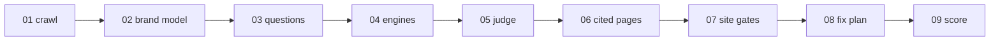

<p align="center">
  <picture>
    <source media="(prefers-color-scheme: dark)" srcset="https://raw.githubusercontent.com/yotambraun/saylent/main/website/public/brand/wordmark-dark.svg">
    
  </picture>
</p>

<p align="center">
  The open-source audit of what AI assistants say about your brand, with the receipts.
</p>

<p align="center">
  <a href="https://yotambraun.github.io/saylent/docs">Docs</a> ·
  <a href="https://yotambraun.github.io/saylent/docs/quickstart">Quickstart</a> ·
  <a href="examples/kestrel/">Sample report</a> ·
  <a href="https://saylent-demo.vercel.app/app">Live demo</a>
</p>

<p align="center">
  <a href="https://github.com/yotambraun/saylent/actions/workflows/ci.yml"></a>
  <a href="https://www.npmjs.com/package/saylent"></a>
  <a href="https://www.npmjs.com/package/saylent"></a>
  <a href="https://www.npmjs.com/package/saylent"></a>
  <a href="LICENSE"></a>
</p>

<p align="center">
  <picture>
    <source media="(prefers-color-scheme: dark)" srcset="https://raw.githubusercontent.com/yotambraun/saylent/main/website/public/media/hero-report-dark.png">
    
  </picture>
</p>

<p align="center"><sub>
Kestrel Uptime is a fictional company we built and audited for real, hosted at <code>saylent-kestrel.vercel.app</code> so the crawl, the robots.txt read and the live bot probes are genuine. Every other company and host in the sample is pseudonymized to a <code>.example</code> name. It is a brand nobody has heard of yet, so every count in it is zero, and that is the finding.<br>
Read the whole run in <a href="examples/kestrel/">examples/kestrel</a>, or re-render it offline for $0 with <code>npx saylent report examples/kestrel/run.json</code>.
</sub></p>

```bash
npx saylent audit example.com
```

Bring your own `OPENAI_API_KEY` and `ANTHROPIC_API_KEY`. One is enough; two let a
model from the other provider family judge. Export them, put them in a `.env` in
the folder you run from, or run `saylent keys set openai`.

A smoke run costs about **$0.40 to $1.20 with four engines** (our recorded runs
cost $0.93 and $1.11) of your own provider credits, a full run **$2.50 to $4.00**. The CLI
defaults to the smoke profile; the self-hosted app defaults to the full profile
and shows the estimate before every run. `--dry-run` prints the plan and the
estimate for free, and `--max-usd 1` refuses to start above a cap. Nothing is
sent through us, and there is no telemetry. Node 20 or newer to run the CLI,
Node 22 or newer to develop or self-host the app, on macOS, Linux or Windows.

<p align="center">
  
</p>

## Why

- I cannot see what ChatGPT, Claude, Gemini and Perplexity tell my buyers about us.
- When a tool tells me I am invisible, I want the answer it read that from.
- I do not want a score. I want the next thing to change on my site.
- My API keys and my data should stay on my machine.
- I want the first result in about five minutes, without an account or a sales call.

The command is fully local: your keys, the pages it fetches and the files it
writes never leave your machine. The app is the part that needs a Postgres
database, and a free Supabase project is the fastest way to get one; a fully
self-hosted database recipe is an open good-first-issue.

## What you get, with the receipt behind each one

**Verdict.** What the engines actually recommend, as a count over the questions
that were scored, never a single invented number.

<p align="center">
  <picture>
    <source media="(prefers-color-scheme: dark)" srcset="https://raw.githubusercontent.com/yotambraun/saylent/main/website/public/media/receipt-verdict-dark.png">
    
  </picture>
</p>

**Receipt.** The exact answer, the engine, the date, and the pages that answer
was built from.

<p align="center">
  <picture>
    <source media="(prefers-color-scheme: dark)" srcset="https://raw.githubusercontent.com/yotambraun/saylent/main/website/public/media/receipt-answer-dark.png">
    
  </picture>
</p>

**Gate.** Which AI bots your site lets in: what robots.txt says per bot, and
what actually happens when we fetch a page as one.

<p align="center">
  <picture>
    <source media="(prefers-color-scheme: dark)" srcset="https://raw.githubusercontent.com/yotambraun/saylent/main/website/public/media/receipt-gate-dark.png">
    
  </picture>
</p>

**Fix.** Drafted from your own evidence and ready to paste. Here, the
Organization, Product and FAQPage JSON-LD the crawl found missing.

<p align="center">
  <picture>
    <source media="(prefers-color-scheme: dark)" srcset="https://raw.githubusercontent.com/yotambraun/saylent/main/website/public/media/receipt-fix-dark.png">
    
  </picture>
</p>

Every run writes three files: `report.html` (self-contained, opens from disk,
follows your system theme, safe to email or drop in Slack), `report.md`, and
`run.json`, the lossless bundle with every raw answer, every sampled draw and
every citation. `run.json` is also what `saylent verify` and `saylent history`
read later.

## Ways to run it

A read-only copy of the app runs at [https://saylent-demo.vercel.app/app](https://saylent-demo.vercel.app/app) on the Kestrel Uptime sample: every screen, nothing saves, no account.

**The command.** `npx saylent audit example.com`. No install, no account, no
database. `saylent questions` prints the buyer questions and the brand model
before you spend anything; `saylent models` prints which model fills which role.
`saylent gate-check example.com` needs no key at all.
[Quickstart](https://yotambraun.github.io/saylent/docs/quickstart) ·
[The crawler](https://yotambraun.github.io/saylent/docs/crawler) (UA string, rate, how to allow or block it)

The flags a first run usually reaches for:

| Flag | What it does |
| --- | --- |
| `--max-usd <n>` | Refuse to run if the high cost estimate exceeds this many dollars. |
| `--dry-run` | Print the plan, the questions it would ask and the cost estimate. Spends nothing. |
| `--profile <name>` | `smoke` (6 questions, the default) or `full` (23 questions). |
| `--engines <a,b>` | Which engines to ask: `chatgpt`, `claude`, `gemini`, `perplexity`. Default: every one you have a key for. |
| `--samples <n>` | How many times each scored question is asked, 1 to 5. Default: 1 on smoke, 2 plus an adaptive tiebreak on full. |
| `--skip <a,b>` | Skip costly stages: `drafts` (no fix artifacts), `corpus` (no cited-page fetches), `gates` (no site checks). |
| `--questions <file>` | Ask your own set: a `run.json`, a `questions.json` from `saylent questions`, or a text file with one question per line. |
| `--judge <model>` | The judge model. Its provider family is inferred from the name. |
| `--model <role>=<id>` | Override one role's model. Roles: `brand`, `drafter`, `chatgpt`, `claude`, `gemini`, `perplexity`. |
| `--format <a,b>` | Which files to write: `md`, `html`, `json`. Default: all three. |

Every other flag, and the `verify`, `history`, `report`, `keys` and `gate-check`
commands, are in the [CLI reference](https://yotambraun.github.io/saylent/docs/cli).

**The app, on your own infrastructure.** History across runs, scheduled
verifies, a fixes tracker, rival comparison, multiple users on one deployment,
share links, and an operator console with spend caps. Your own Supabase
project, on any Node host, Docker, or one click on Vercel. The first sign-up
becomes the operator; there is no separate admin setup.
[Self-host](https://yotambraun.github.io/saylent/docs/self-host) ·
[](https://vercel.com/new/clone?repository-url=https%3A%2F%2Fgithub.com%2Fyotambraun%2Fsaylent&project-name=saylent&repository-name=saylent&env=NEXT_PUBLIC_APP_URL%2CNEXT_PUBLIC_SITE_URL%2CNEXT_PUBLIC_APP_NAME%2CNEXT_PUBLIC_SUPABASE_URL%2CNEXT_PUBLIC_SUPABASE_ANON_KEY%2CSUPABASE_SERVICE_ROLE_KEY%2CDATABASE_URL%2CDIRECT_DATABASE_URL%2COPENAI_API_KEY%2CANTHROPIC_API_KEY%2CINNGEST_EVENT_KEY%2CINNGEST_SIGNING_KEY&envDescription=Your%20own%20Supabase%20project%2C%20Inngest%20keys%20and%20LLM%20API%20keys%20-%20Saylent%20runs%20entirely%20on%20your%20accounts&envLink=https%3A%2F%2Fyotambraun.github.io%2Fsaylent%2Fdocs%2Fself-host%2Fenvironment)

**The GitHub Action.** One step, on every push, runs the same AI-access checks
as the Gate receipt above: robots.txt per bot, a live fetch as each crawler,
JSON-LD and meta directives. No LLM calls, no API keys, $0. It writes an
AI-access badge into your repo and fails the job only when a search or
user-fetch bot is blocked.

```yaml
# .github/workflows/ai-access.yml
on: [push]
jobs:
  ai-access:
    runs-on: ubuntu-latest
    steps:
      - uses: yotambraun/saylent@v0
        with:
          domain: example.com
```

[Inputs and outputs](packages/action/) ·
[Integrations](https://yotambraun.github.io/saylent/docs/integrations)

**From your own code.** `import { runAudit } from "@saylent/engine"` and
`import { renderReportHtml } from "@saylent/report/render/html"` run the same
pipeline and the same renderer the command uses, and `saylent mcp` exposes the
same tools to an MCP client.
[Integrations](https://yotambraun.github.io/saylent/docs/integrations)

## How a run works

<p align="center">
  <picture>
    <source media="(prefers-color-scheme: dark)" srcset="https://raw.githubusercontent.com/yotambraun/saylent/main/website/public/brand/pipeline-dark.svg">
    
  </picture>
</p>

<details>
<summary>The same nine stages as a Mermaid diagram</summary>



</details>

We ask real buyer questions to real AI engines through their official APIs and
record every answer verbatim. Presence is decided by a deterministic alias
match; a judge model from the other provider family decides the rest, quoting
its reasoning first. We fetch the pages an answer cites and check them for the
same presence, word match rather than entailment. We report a confidence band,
never a single fake-precise number.
[Methodology](METHODOLOGY.md) ·
[Architecture](ARCHITECTURE.md)

## What this does not tell you

- One run is a snapshot of the official API surface on one date. Consumer apps can answer differently, and Google AI Overviews has no API, so it is not measured.
- Share of voice counts mentions in the answers we drew, not market share, and cited-page checks are word presence, not entailment.
- No traffic estimate, no revenue effect, no ranking claim, and no claim that a fix caused a movement. Movement after a fix is correlation.

## Compared with hosted tools

What the hosted products do that this does not, and what this does that they do
not, written plainly:
[Compared with hosted tools](https://yotambraun.github.io/saylent/docs/compare).

## Contributing

The test suite needs no keys and no database: `npm install && npm test` runs the
full suite at $0. Running the app locally needs a Supabase project, which the
[self-host docs](https://yotambraun.github.io/saylent/docs/self-host) walk
through. Adding an answer engine is one file implementing the `Ask` interface;
adding a site check is one registry entry and one test. Start with
[CONTRIBUTING.md](CONTRIBUTING.md) and the
[contributing guide](https://yotambraun.github.io/saylent/docs/contributing) for
the recipes, the PR checklist, and the good-first-issue list.
[CODE_OF_CONDUCT.md](CODE_OF_CONDUCT.md) ·
[CHANGELOG.md](CHANGELOG.md)

## Security and license

Found a security issue? [SECURITY.md](SECURITY.md) has the private disclosure
route. Questions and ideas belong in
[Discussions](https://github.com/yotambraun/saylent/discussions). Licensed under
[Apache-2.0](LICENSE).
